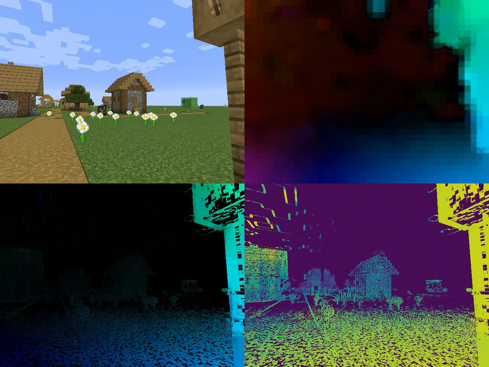

# depth-from-motion

Get depth frame from optical flow and known camera pose.



## Dependencies

* python3
* numpy
* matplotlib
* opencv
* numba
* cmapy
* scipy
* ffmpeg (optional for merge output videos)

## Usage

First obtain video and camera pose data, and change the parameters inside `getWallXYZ.py` and `depthFromMotion.py` accordingly.

Pose data is in `timestamp x y z pitch yaw` format. I use Minecraft for testing so there is no `roll` data.

Download demo video and camera pose data [here](https://drive.google.com/file/d/1cQ1xfY8rflowo3hA005abh-bGgWYiFSo/view?usp=sharing), decompress and extract it to the working directory.

```bash
python3 getWallXYZ.py
python3 depthFromMotion.py
./merge.sh #(optional: merging videos for demo convenience)
```

The output video are `output*.mkv` and optional `compare.mkv`.

